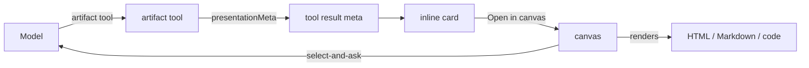

# DeepSeek Harness Artifact Canvas

**Render HTML, Markdown, and code in a side panel — with syntax highlighting, select-and-ask, and an extensible plugin API.**

[](LICENSE)
[](https://github.com/deepseek-ai/deepseek-harness)
[](CONTRIBUTING.md)
[](https://github.com/MexxiUK/dsh-artifacts/releases)

<video src="docs/hero.webm" autoplay muted loop playsinline poster="docs/hero.png" style="max-width: 100%;">
  DeepSeek Harness Artifact Canvas rendering an artifact in the side panel.
</video>

The Artifact Canvas brings Claude- and Gemini-style artifacts to
[DeepSeek Harness](https://github.com/deepseek-ai/deepseek-harness). When the
model builds a web page, a document, or a code file, the canvas renders it in a
dedicated side panel instead of dumping raw text into the chat.

## Contents

- [The problem](#the-problem)
- [What this plugin solves](#what-this-plugin-solves)
- [Packages](#packages)
- [How it works](#how-it-works)
- [Select and ask](#select-and-ask)
- [Extensibility](#extensibility-child-slots)
- [Installation](#installation)
- [Build](#build)
- [Known limitations](#known-limitations)

## The problem

DeepSeek Harness is a powerful coding agent, but it has no first-class way to
*show* what the model produces. A generated HTML page, a Markdown report, or a
code file appears as plain text in the conversation. You cannot render it,
inspect it, or ask a question about a specific part of it.

## What this plugin solves

This plugin adds a dedicated **Artifact canvas** to the `details` column. The
model writes artifacts through a new `artifact` tool, and the canvas renders
them live. You can:

- **Render HTML, Markdown, and code** in a sandboxed, scrollable panel.
- **Read code with syntax highlighting** (shiki) — no more raw text.
- **Select and ask** — drag a rectangle over any region and ask the model about
  it.
- **Extend it** — other plugins add renderers, toolbar buttons, and panels
  through child slots.
- **Track liveness** — a badge marks the current artifact versus older versions.
- **Work in a wide layout** — the canvas opens at ~55% and resizes to ~70% of
  the viewport, Gemini-style.

| Without the canvas | With the canvas |
|---|---|
| HTML, Markdown, and code appear as raw text in the chat | Rendered in a dedicated side panel |
| No syntax highlighting | shiki syntax highlighting for every language |
| Cannot ask about a specific part | Drag-select any region and ask the model |
| One-size-fits-all output | Extensible renderers, chrome, and panels |
| No sense of what is current | A live badge marks the latest artifact |

## Packages

| Package | Plane | Role |
|---|---|---|
| `packages/tool-artifact` | host (agent preset) | Registers the `artifact` tool and a system-prompt section. |
| `packages/client-ui-artifact` | browser | Registers the canvas, the inline card, the renderers, the select-and-ask loop, and the liveness badge. |
| `packages/client-ui-layout` | browser | A fork of `dsh-client-ui-layout` with wide details. |

## How it works

1. The model calls `artifact` with `action: create` and the artifact source.
2. The tool stores the artifact envelope in the tool result `meta`. The envelope
   holds `artifact_id`, `title`, `type`, `content`, `language`, and `version`.
3. The inline card reads the `meta`. It shows a preview and an "Open in canvas"
   button.
4. "Open in canvas" selects the artifact. It calls `ctx.layout.openDetails()`.
   The side panel opens. It renders Markdown with `MarkdownText`, HTML in a
   sandboxed iframe, or source code with `CodeBlock`.
5. A **Preview / Code** toggle switches between the rendered view and the raw
   source. The Code view shows syntax highlighting. The highlighting uses the
   artifact `language`.



## Select and ask

The canvas header has a **Select** button. Click the button to enter select
mode. A crosshair overlay covers the preview. Drag to draw a rectangle. Release
to show a popup. Type a question or describe an issue. Press Enter or click
**Send**.

The canvas extracts the text under the selection. For Markdown and code, it
extracts the text. For HTML, it reports the region geometry. The iframe is
opaque-origin, so the parent cannot read its text. The canvas feeds the text
and your question to the model as a queued user message.

## Extensibility (child slots)

The canvas declares four child slots. Other plugins use these slots to extend
the canvas.

| Slot | Kind | What plugins add |
|---|---|---|
| `artifact.renderer` | keyed by artifact `type` | New renderers. Built-in: `html`, `markdown`, `code`. |
| `artifact.interaction` | list | postMessage handlers for the iframe. |
| `artifact.chrome` | list | Toolbar buttons and status indicators. |
| `artifact.panel` | list | Extra panels and tabs. |

Register into a slot like any DSH slot:

```js
ctx.slots.inject("artifact.renderer", () =>
  ctx.slots.register({ name: "artifact.renderer", key: "mermaid" }, MermaidRenderer),
);
```

## Interaction loop

HTML artifacts run in an opaque-origin iframe. The artifact can send
`postMessage({ v: 1, type: "artifact:select", value, label })` to the parent.
The canvas checks `event.origin === "null"`. It then feeds the selection to the
model as a queued user message.

## Liveness

The canvas marks the selected artifact **Live** (green, pulsing) while it is
the latest one. It marks older artifacts **Older** (muted).

## Installation

### Quick install

Run the installer:

```sh
./install.sh
```

The script copies the three packages, patches the profile, and creates the
`artifact` agent preset. For the preset base it uses the `standard` preset that
ships with your installed DeepSeek Harness (so it matches your version),
falling back to a frozen copy shipped in this repo. It is idempotent — run it
again to reinstall or to pick up changes. Then restart DeepSeek Harness:

```sh
ollama launch dsh
```

### Manual install

1. Install the packages at `$DSH_HOME/profiles/node_modules/@dsh-artifact/`.
2. Add the client plugin to `$DSH_HOME/profiles/web/cordis.patch.yml`. The
   `details` registration shadows the built-in `DetailsPanel`. It registers at
   `priority: -10`. Do not rely on load order. The loader applies entries in
   parallel. Two registrations at the same priority on one slot throw and stop
   the plugin load.
3. Create the agent preset `artifact` at `$DSH_HOME/.agent-presets/artifact/`.
   It is a copy of `standard` plus the `tool-artifact` row. Set it as the
   default.
4. Install the layout fork `@dsh-artifact/client-ui-layout`. Swap it in through
   the patch layer. Disable the shipped `ui-layout` row. Insert the fork as
   `ui-layout-wide`.

## Build

Build the client bundle with esbuild. The bundle uses the
`window.__ModuleLoader__.load` format.

```sh
cd packages/client-ui-artifact
npx esbuild src/client.tsx \
  --bundle --format=cjs --jsx=automatic \
  --external:react --external:react/jsx-runtime \
  --external:@deepseek-ai/dsh-client-ui-primitives \
  --outfile=lib/client.js \
  --banner:js='window.__ModuleLoader__.load({ id: "@dsh-artifact/client-ui-artifact", factory: (require) => { var module = { exports: {} }; var exports = module.exports;' \
  --footer:js='return module.exports; } });'
```

## Restart to apply

The server hot-reloads the patch layer. It re-reads bundle files on each
request. So patch and bundle edits need only a page refresh. The server reads
the `package.json` metadata (`dsh.client.inject`) at boot. A change there needs
a full `ollama launch dsh` restart. Until then, the stale `inject` hint is
harmless. The cordis runtime defers each plugin `apply` until its services
arrive.

## Known limitations

- One selected artifact at a time. There is no per-session keying yet.
- Version history is in the log. There is no version switcher yet.
- HTML runs scripts in an opaque-origin sandbox. There is no CSP meta yet.
- Localization is hardcoded English.
- The built-in interaction loop handles `artifact:select` only. Other message
  types use the `artifact.interaction` slot. The canvas cannot send messages
  back to the iframe yet.
- The layout fork is a byte-copy of `dsh-client-ui-layout`. Re-sync it if the
  upstream layout changes.
